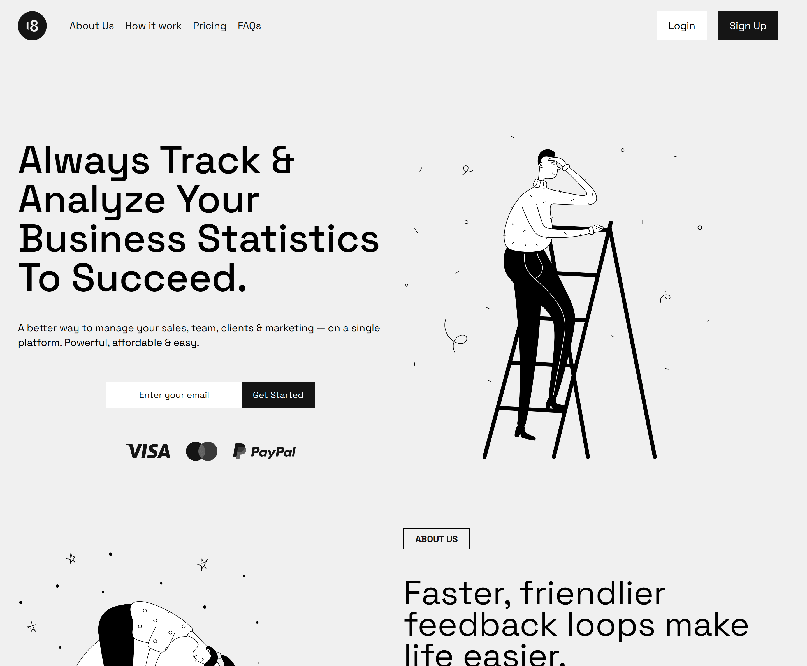

# High Landing Page



A modern, responsive landing page built with HTML, CSS and JavaScript. This project demonstrates a clean and professional design implementation with smooth animations and mobile-first approach.

## ✨ Features

- Fully responsive design (mobile, tablet, desktop layouts)
- Modern hamburger menu for mobile navigation
- Smooth hover animations on buttons
- Collapsible FAQ sections
- Newsletter subscription forms
- Social media integration
- CSS Grid and Flexbox layouts
- Modern normalize CSS reset

## 🖥️ Technologies Used

- HTML5
- CSS3
- JavaScript
- Space Grotesk Font
- Modern Normalize CSS

## 📁 Project Structure

```
├── css/
│   ├── modern-normalize.css
│   └── styles.css
├── public/
│   ├── imgs/
│   │   ├── icons/
│   │   ├── illustrations/
│   │   └── logos/
├── script.js
├── index.html
└── README.md
```

## 🚀 Setup

1. Clone the repository
2. Open index.html in your browser
3. No build process required - pure HTML, CSS and JavaScript

## 🎨 Credits

Design by [The 18 Design](https://www.figma.com/community/file/1370314670930501378) - Licensed under [CC BY 4.0](https://creativecommons.org/licenses/by/4.0)

## 📝 License

This project is available under the CC BY 4.0 license.
